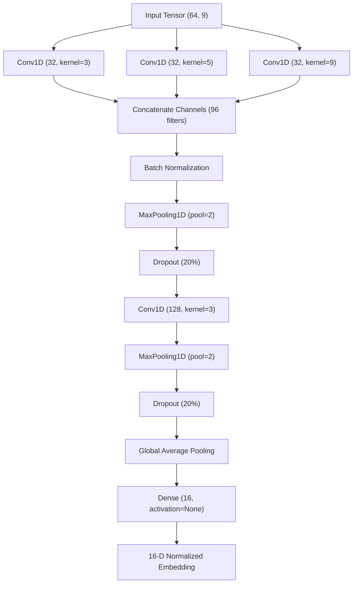

# TinyML Model Pipeline: Universal IMU CNN (23-Primitive Basis)

Status: Active
Language: English
Owner: ML Maintainers
Last Updated: 2026-07-10

## 1. Architectural Philosophy: The Universal Metric Space

Traditional TinyML gesture recognizers train a classification network to learn a fixed set of spells. This approach fails when users want to register custom, out-of-distribution (OOD) spells, as it requires collecting new data and retraining/re-quantizing the entire network.

The **Universal IMU CNN** shifts the paradigm from shape classification to **metric learning**:
- **Feature Extractor Base**: The 1D-CNN is trained to project raw gestures into a highly discriminative **16-dimensional embedding space** (L2-normalized).
- **Prototypical Few-Shot Recognition**: Custom user spells are registered on-the-fly by computing their 16-D centroids (prototypes) using a few recorded samples.
- **The 23-Primitive Basis**: By training the base network on 23 fundamental kinematic atoms (primitives), the 16-D space is topologically locked. Any complex gesture is represented as a sequence or combination of these primitive trajectories, removing the need to ever retrain the base CNN.

---

## 2. The 23 Kinematic Primitives

The dataset is partitioned into 23 primitives spanning 6 mechanical systems:

### System 1: Linear Translations (6 Primitives)
Locks the 6 directions of 3D space and teaches the CNN basic linear acceleration profiles.
- **SWIPE_UP** (Y+ axis)
- **SWIPE_DOWN** (Y- axis)
- **SWIPE_LEFT** (X- axis)
- **SWIPE_RIGHT** (X+ axis)
- **THRUST** (Z+ axis / Forward poke)
- **PULL** (Z- axis / Pull back)

### System 2: Gyroscopic Rotations (3 Primitives)
Isolates pure wrist rotation from forearm translation.
- **WRIST_FLICK** (Pitch / Quick vertical snap)
- **ROLL_WAND** (Roll / Screwdriver twist)
- **YAW_SWISH** (Yaw / Side-to-side sweep)

### System 3: Planar Curves (4 Primitives)
Teaches the model centrifugal force and gravity distribution across 3 orthogonal planes.
- **CIRCLE_CW** (XY plane / Clockwise circle)
- **CIRCLE_CCW** (XY plane / Counter-clockwise circle)
- **LASSO** (XZ plane / Overhead horizontal circle)
- **WHEEL** (YZ plane / Side vertical circle)

### System 4: Dynamic Kinetics (4 Primitives)
Instructs the network on corner sharp angles, kinetic dissipation, and rapid deceleration.
- **V_SHAPE** (Sharp bounce, <90° bend)
- **SQUARE** (Orthogonal 90° turn with velocity = 0 at the corner)
- **U_SHAPE** (Smooth 90° curve without a full stop at the bottom)
- **ZIGZAG** (180° motion reversals with aggressive energy dissipation)

### System 5: Asymmetry & Shock (5 Primitives)
Trains the CNN to identify muscle rhythm asymmetry and physical hardware shocks.
- **WHIP** (Time-series asymmetry: slow pull-back followed by an explosive forward snap)
- **TAP** (Mechanical shock spike: <5 frames, gyroscope near zero; filters out physical desk bumps)
- **SPIRAL** (Corkscrew: simultaneous linear thrust and roll/pitch rotation)
- **INFINITY_8** (Phase-locked horizontal figure-8 pattern)
- **SHAKE_VIOLENT** (Chaotic high-frequency noise, used to isolate tremor and jitter)

### System 6: Null State (1 Primitive)
- **STAND_BY** (Static gravity vector absorption and bio-tremor filtering; acts as the idle sink class)

---

## 3. Input Layer & Feature Engineering (9 Channels)

To reduce the sample complexity of the 1D-CNN, physical coupling features are explicitly calculated at the input layer. The network processes a window of **64 samples** with **9 channels**:

$$\mathbf{X} \in \mathbb{R}^{64 \times 9}$$

### Kênh dữ liệu (Channels):
1. **ax** (Raw Accelerometer X / scaled by 32768.0)
2. **ay** (Raw Accelerometer Y / scaled by 32768.0)
3. **az** (Raw Accelerometer Z / scaled by 32768.0)
4. **gx** (Raw Gyroscope X / scaled by 32768.0)
5. **gy** (Raw Gyroscope Y / scaled by 32768.0)
6. **gz** (Raw Gyroscope Z / scaled by 32768.0)
7. **az_gx** ($a_z \times g_x$: Cross-channel coupling, captures pitch/thrust correlation)
8. **az_gy** ($a_z \times g_y$: Cross-channel coupling, captures roll/thrust correlation)
9. **jerkz** ($a_z^{(t)} - a_z^{(t-1)}$: Z-axis linear jerk)

### Normalization & Guardrails:
- **Scale Matching**: Because raw inputs are pre-divided by $32768.0$, they are normalized to $[-1.0, 1.0]$. The cross-products naturally map to $[-1.0, 1.0]$ and the jerk maps to $[-2.0, 2.0]$.
- **Spike Clipping**: A hard clip at $[-2.0, 2.0]$ is applied to the 9-channel input to eliminate spurious sensor noise without saturating deliberate high-energy gestures (e.g., WHIP, SHAKE).
- **Firmware History Buffer**: Jerk at $t=0$ uses the frame immediately preceding the window start in the circular buffer. This prevents boundary zero/NaN artifacts that degrade validation accuracy.

---

## 4. Multi-Scale Feature Pyramid CNN Architecture

The model is built using the Keras Functional API to extract temporal features at multiple scales concurrently (similar to an Inception block):

- **Conv 1D Kernel 3**: Captures fine-grained, high-frequency transients (e.g. TAP).
- **Conv 1D Kernel 5**: Captures mid-frequency transitions (e.g. SWIPES, FLICKS).
- **Conv 1D Kernel 9**: Captures slow, coarse spatial trajectories (e.g. INFINITY_8, SPIRAL).

---

## 5. Training Protocol & Quality Safeguards

To ensure the encoder generalizes robustly and does not overfit to the few-shot training samples:

### Data Leakage Prevention (Pre-Augment Split)
To evaluate the model cleanly, the train/validation split (default 85/15) is executed on the **base windows prior to augmentation**. This ensures that simulated variations (e.g. scaled or shifted siblings) of a training sample never appear in the validation set, preventing artificial val_accuracy inflation.

### Few-Shot Oversampling Logs
For classes with low counts, the pipeline oversamples them to 6,000 training windows using Gaussian noise injection, amplitude scaling (0.8x to 1.2x), and time-shifting. The pipeline logs the raw count and expansion ratio per class (e.g. `[TRAIN] Few-shot: Augmenting 'TAP' from 40 -> 6000 samples (Oversample x150.0)`) to explicitly communicate overfitting risks.

### Adaptive Per-Class Rejection Thresholds
Different primitives have different spatial variances in the 16-D embedding space (e.g., `STAND_BY` clusters tightly, while `INFINITY_8` is highly spread).
- Instead of a global reject threshold (e.g. 0.65), the pipeline calculates the **5th percentile of cosine similarities** between the training samples of each class and their respective centroid.
- This results in a class-specific threshold array (clamped between `0.50` and `0.85`) exported directly into the C header (`g_preloaded_spells[i].threshold`).

---

## 6. ESP32 Firmware Integration & Compatibility

The generated C header (`gesture_model.cc` / `main.cpp`) bridges the Python model and the device:

### Dynamic Channel Capability
The firmware reads `s_input->dims->data[2]` dynamically to determine model dimensions:
- **9 Channels**: The firmware internally expands the 6-channel raw circular buffer on-the-fly by computing `az*gx`, `az*gy`, and `jerkz` (using the circular buffer history for index `-6` relative to window start) before quantizing to INT8.
- **6 Channels (Fallback)**: Copy raw IMU values directly, maintaining backward compatibility with older models.

### Open-Set Reject Mechanism
During inference:
1. The 16-D output embedding is L2-normalized on-device:

   $$\hat{v} = \frac{v}{\|v\|_2 + \epsilon}$$

2. Cosine similarity is calculated against all preloaded centroids via dot-product:

   $$\text{sim}_i = \sum_{j=1}^{16} \hat{v}_j \times C_{ij}$$

3. The class with the highest similarity is selected (`max_idx`).
4. **Threshold Check**: If $\text{sim}_{\text{max}} < \text{threshold}_{\text{max\_idx}}$, the gesture is rejected and classified as `SpellId::UNKNOWN`. This isolates spelling gestures from random OOD movements.

### Model Cache Safety
To prevent loading invalid weights when changing architectures, the pipeline caches training checkpoints under `gesture_model_v2.h5`. If Keras detects a layer mismatch (e.g. transitioning from 6 to 9 channels), it catches the `ValueError`, deletes the stale `.h5` file, and automatically initiates training from scratch.
